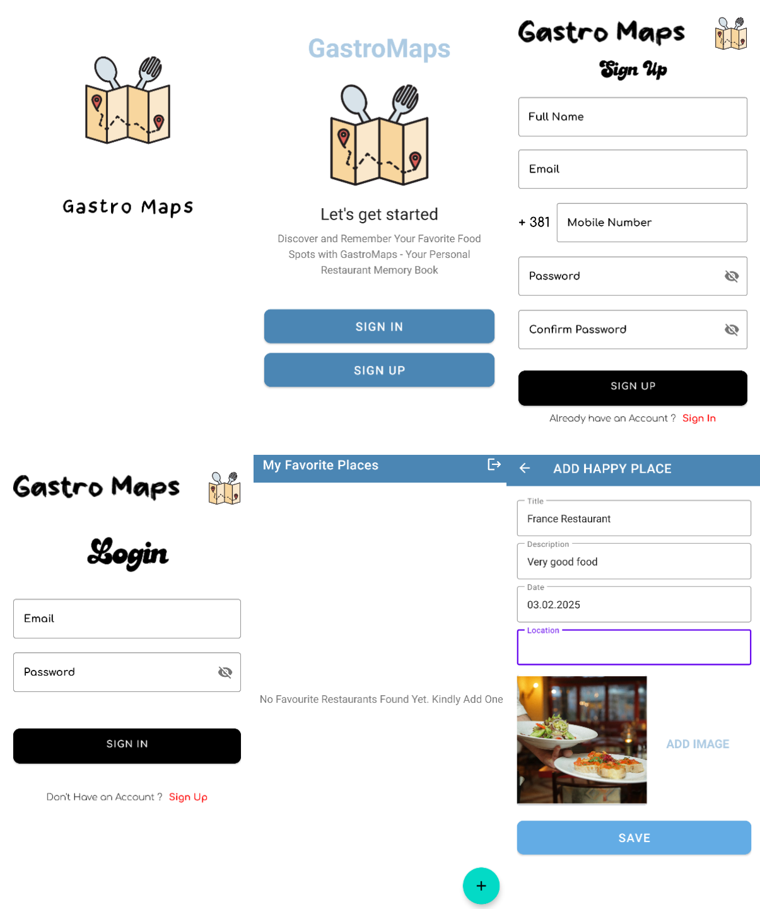

# **🍽️ GastroApp – Discover the Best Restaurants!**  

Welcome to the **GastroApp** repository! 🎉 This Android application helps food lovers 🍕🍣🍔 find the best restaurants based on location, preferences, and reviews.  

## **📌 Table of Contents**  
- 📖 **[Overview](#overview)** 
- 🚀 **[Features](#features)** 
-  **[🧑‍💻 Technologies](#technologies)**  
- 📸 **[App Screenshot](#app-screenshot)**  
- 🤝 **[Contributing](#contributing)**  

📖 ## **Overview**  
**GastroApp** is an Android app that allows users to easily discover top-rated restaurants nearby. With personalized recommendations, detailed reviews, and interactive maps, it's the perfect tool for finding new dining experiences.  

🚀 ## **Features**  
- 🍔 **Restaurant Discovery**: Find top-rated restaurants nearby!  
- 🗺️ **Location-based Recommendations**: Personalized suggestions based on your location and preferences.  
- ⭐ **User Reviews & Ratings**: View ratings and reviews from other users to make informed decisions.  
- 📍 **Interactive Map**: Navigate to your favorite restaurants easily with Google Maps integration.  
- ❤️ **Favorites**: Save your favorite spots for quick access.  

##  **🧑‍💻 Technologies**  
- 📝 **Kotlin**: Modern and expressive programming language for Android development.  
- 🔥 **Firebase**: Authentication, Firestore for real-time database, and Firebase Storage for media management.  
- 🌍 **Google APIs**: Location services and Maps integration for discovering restaurants.  
- 🏗️ **MVC Architecture**: Model-View-Controller design pattern for clean separation of concerns.  

📸 ##  **App Screenshot**  
  

## **🤝 Contributing**  
Contributions are welcome! Feel free to submit a pull request or open an issue.  
